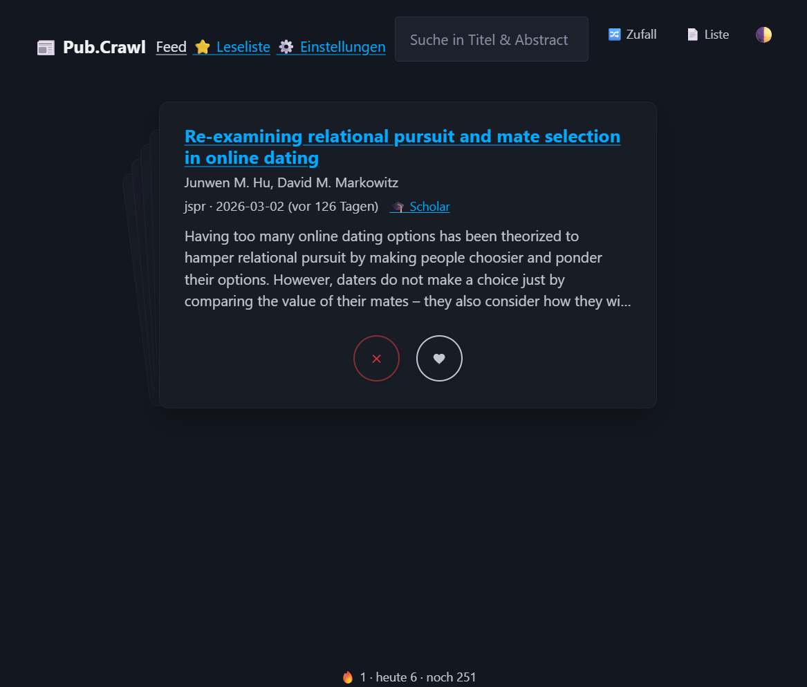
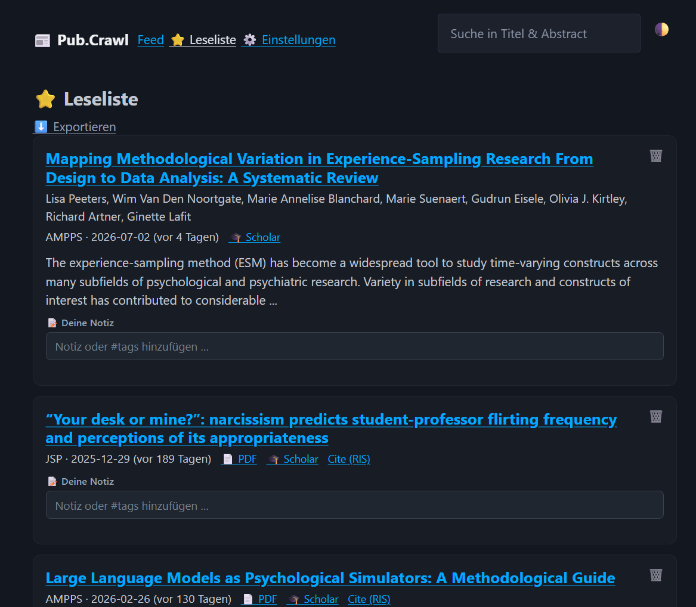

# Pub.Crawl

[](LICENSE)

[](https://doi.org/10.5281/zenodo.21216115)

A local web app for staying current with the literature. Pub.Crawl aggregates
journal RSS feeds, lets you triage new papers by swiping through a card stack,
and keeps the ones you want in a reading list. It runs entirely on your machine;
no account, no server, no data leaves your computer. It just crawls all the publications you want.

---

## Screenshots

| Card stack (feed) | Reading list |
|---|---|
|  |  |

---

## What it does

- Reads multiple RSS/Atom feeds (journals, preprint servers) in parallel and caches them.
- Two views for the feed: a swipeable **card stack** (default) and a plain **list**.
- **Like** adds a paper to the reading list, **skip** hides it; both are undoable.
- Sort by shuffle, newest-first, or **relevance** — a local model that learns from
  your likes and skips. It unlocks once there is enough data and shows which words
  made a paper match.
- Fills in **full abstracts and clean author lists** from CrossRef (with an OpenAlex
  fallback) when a feed only ships a citation stub. Publisher boilerplate is stripped.
- Per-paper links: Open Access via Unpaywall, Google Scholar, and RIS export for citation managers.
- Reading list with free-text notes / `#tags` and full-list RIS export.
- Built-in catalog of psychology journal feeds; add feeds by checkbox, OPML, or manually.
- Move reading-list and read state between machines via JSON export/import (merge, not overwrite).
- Broken feeds are flagged; `verify_feeds.py` checks the catalog for dead URLs.
- Small extras: daily streak, "seen today" counter, dark/light mode, keyboard shortcuts.

State lives in a local SQLite database. Configuration is a single YAML file.

---

## Install

```bash
git clone https://github.com/paulheineck/readr.git
cd readr
python -m venv .venv
.venv\Scripts\activate        # Windows
# source .venv/bin/activate   # macOS/Linux
pip install -r requirements.txt
```

## Run

Use the launcher for your OS — it sets up the virtual environment, installs
dependencies, waits for the server, and opens the browser:

```bash
"start Windows.bat"     # Windows
bash "start Mac.sh"     # macOS
bash "start Linux.sh"   # Linux
```

Or run it manually:

```bash
python app.py           # then open http://localhost:5000
```

On first start there are no feeds configured — the app links you to the catalog
to pick some. `config.yaml` and `dashboard.db` are created automatically. The
first load fetches feeds and abstracts in the background and shows a loading
screen; results are cached afterwards.

---

## Configuration

Feeds and filters live in `config.yaml`, but you rarely need to edit it by hand —
the **Settings** page covers adding feeds, the catalog, OPML, the allowlist, and
regex filters. The file looks like this:

```yaml
feeds:
  - name: PSPB
    url: https://journals.sagepub.com/action/showFeed?type=etoc&feed=rss&jc=psp
  - name: Nature Human Behaviour
    url: https://www.nature.com/nathumbehav.rss

filters:
  include: []                                  # empty = keep all
  exclude:
    - "(?i)erratum|corrigendum|call for papers"
  journal_allowlist: []                        # empty = show all feeds

display:
  max_items_per_feed: 30
  show_abstract: true

api:
  unpaywall_email: ""                          # optional, for Open-Access lookups
```

`config.yaml` is per-user and not tracked in git; it is created from
`config.example.yaml` on first run.

---

## Keyboard shortcuts

| Key | Action |
|---|---|
| `l` | Like / add to reading list |
| `d` | Skip / hide |
| `j` / `k` | Move down / up (list view) |
| `/` | Focus search |
| `?` | Show shortcut help |

---

## Project layout

```
├── app.py                # Flask backend (feeds, metadata, relevance, routes)
├── templates/
│   ├── index.html        # feed / reading list UI
│   ├── sources.html      # settings
│   └── loading.html      # first-start loading screen
├── config.example.yaml   # template, copied to config.yaml on first run
├── journals.yaml         # curated journal catalog
├── verify_feeds.py       # checks catalog feeds for reachability
├── start Windows.bat / start Mac.sh / start Linux.sh
├── requirements.txt
└── dashboard.db          # local state (auto-created, gitignored)
```

## Dependencies

Flask · feedparser · PyYAML · beautifulsoup4 · requests · python-dateutil · APScheduler

---

## Notes

- Elsevier feeds (e.g. Cognition) do not expose abstracts through any source, so
  those stay title-only. Everything else (APA, SAGE, Wiley, Taylor & Francis, …)
  is enriched automatically.
- Abstract/metadata lookups are cached for 7 days in `dashboard.db`.
- Set `FLASK_DEBUG=1` to run in debug mode; otherwise it runs with debug off.

---

## Citation

If Pub.Crawl is useful for your work, a citation is appreciated. GitHub shows a
**“Cite this repository”** button, driven by [`CITATION.cff`](CITATION.cff).

```bibtex
@software{heineck_pubcrawl,
  author  = {Heineck, Paul},
  title   = {Pub.Crawl — A Local Research Feed Reader},
  year    = {2026},
  url     = {https://github.com/paulheineck/readr},
  version = {1.0.0},
  doi     = {10.5281/zenodo.21216115}
}
```

---

## License

MIT License © 2026 [Paul Heineck](https://github.com/paulheineck)
